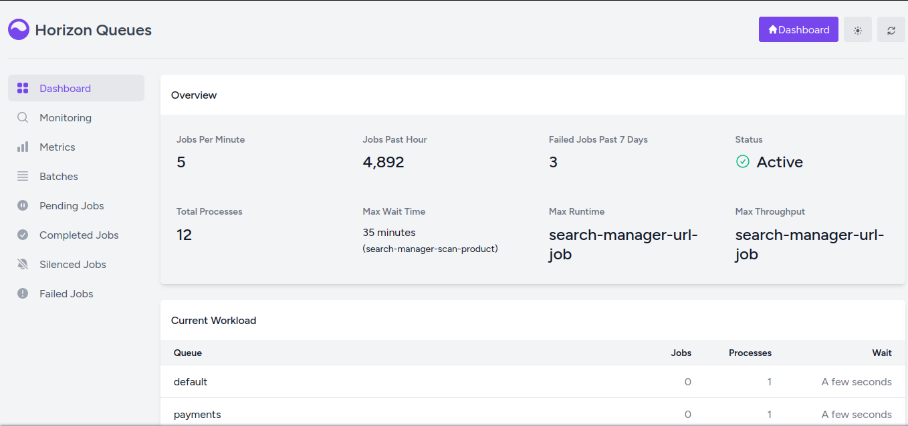

<p align="center"></p>

<p align="center">
<a href="https://github.com/laravel/horizon/actions"></a>
<a href="https://packagist.org/packages/laravel/horizon"></a>
<a href="https://packagist.org/packages/laravel/horizon"></a>
<a href="https://packagist.org/packages/laravel/horizon"></a>
</p>

## Introduction

Horizon provides a beautiful dashboard and code-driven configuration for your Laravel powered Redis queues. Horizon allows you to easily monitor key metrics of your queue system such as job throughput, runtime, and job failures.

All of your worker configuration is stored in a single, simple configuration file, allowing your configuration to stay in source control where your entire team can collaborate.

<p align="center">

</p>

## Official Documentation

Documentation for Horizon can be found on the [Laravel website](https://laravel.com/docs/horizon).

---

### Homepage Route

You can configure a custom application homepage route through the Horizon configuration file.

This route is used by the **Home** button displayed in the Horizon interface, allowing users to quickly return to the main application dashboard.

```php
'homepage' => 'home',
```

The value must be the name of a registered Laravel route.

Example:

```php
'homepage' => 'dashboard',
```

If your application uses a custom dashboard or landing page, simply set the corresponding route name in the configuration.

---

## ✨ Content Security Policy (CSP) Support for Horizon

**Laravel Horizon** adds **full Content Security Policy (CSP) compatibility**, including automatic nonce generation and safe injection into all Horizon inline `<script>` and `<style>` tags.

Modern CSP configurations disallow inline scripts/styles unless they include a valid `nonce`. The original Horizon UI relied on multiple inline scripts, which made it incompatible with strict CSP setups.

Now the Horizon UI so it works correctly under:

- `script-src 'self' 'nonce-...'`
- strict `style-src` rules
- browsers where `unsafe-inline` and `unsafe-eval` are forbidden
- enterprise-grade security environments

---

### 📘 Content Security Policy (CSP) Support

**Content Security Policy (CSP)** is a security standard that helps protect web applications from XSS and content injection attacks. It works by defining which scripts, styles, and external resources are allowed to run.

This fork adds **full, native CSP support to Laravel Horizon**, allowing you to keep strong security rules **without** needing to weaken your policy.

---

## 🔧 How CSP Support Works

This version of Horizon automatically uses the CSP **nonce** you generate in your application and applies it to:

- inline `<script>` tags
- inline style attributes
- Horizon’s boot scripts
- required `<link>` elements (such as fonts or preconnect)

The middleware in your app **shares the nonce globally**, making it available to all Blade views, including Horizon.

---

## ⚙️ Usage

1. Generate a nonce on each request in a middleware.
2. Share the nonce globally (e.g., `view()->share('nonce', $nonce)`).
3. Attach your CSP headers.
4. Register the middleware in the web group.

Horizon will automatically detect the nonce and apply it internally.

---

## 📄 Example Middleware (Oauth2 Passport Server)

Your middleware implementation can be seen here:  
**SecureHeaders:**  
https://github.com/elyerr/oauth2-passport-server/blob/main/app/Http/Middleware/SecureHeaders.php

It handles:

- generating the nonce
- sharing the nonce globally
- applying CSP headers
- providing Horizon-specific CSP rules

---

### 📁 Kernel Registration

#### Laravel 10 and below

```php
protected $middlewareGroups = [
    'web' => [
        \App\Http\Middleware\SecureHeaders::class,
        // other middlewares...
    ],
];
```

#### Laravel 11+

```php
$middleware->web(
    append: [
        SecureHeaders::class,
        // other middlewares...
    ]
);
```

---

## Contributing

Thank you for considering contributing to Horizon! The contribution guide can be found in the [Laravel documentation](https://laravel.com/docs/contributions).

## Code of Conduct

In order to ensure that the Laravel community is welcoming to all, please review and abide by the [Code of Conduct](https://laravel.com/docs/contributions#code-of-conduct).

## Security Vulnerabilities

Please review [our security policy](https://github.com/laravel/horizon/security/policy) on how to report security vulnerabilities.

## License

Laravel Horizon is open-sourced software licensed under the [MIT license](LICENSE.md).
